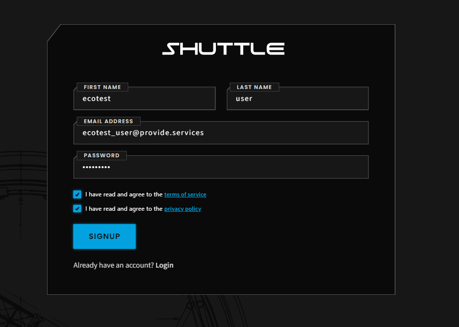
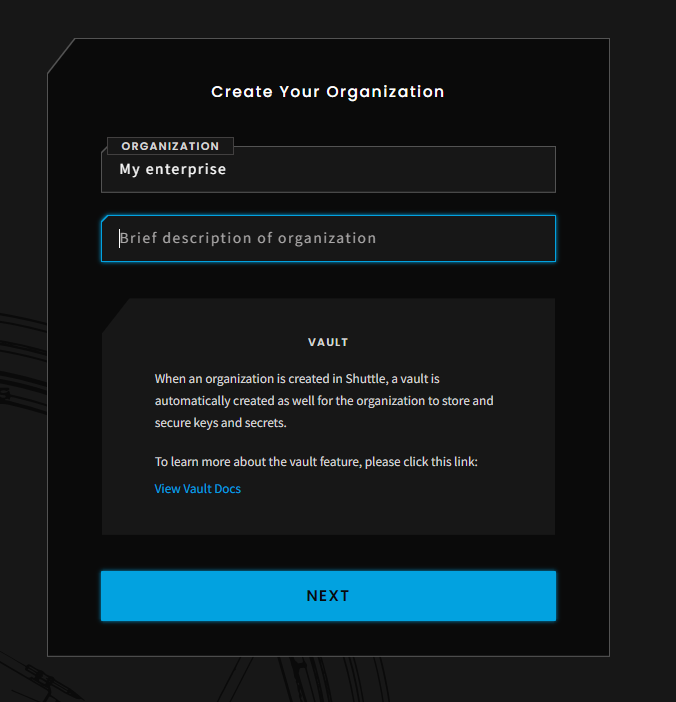

# ECO API - API credentials creation with Provide Shuttle 

For usage of the API for carbon retirements in general applications on web, mobile, etc - complete basic onboarding

For any usage of the API in SAP, ServiceNow or to create the carbon emissions proofs - please also complete Advanced Onboarding

## Basic Onboarding

Go to https://shuttle.provide.services/signup

Create an account with an email and password and acknowledge disclaimers

Create your organization

Workgroup creation is part of the advanced onboarding. If you don't need it, you can head over to the ECO Billing Preferences Page.

## Advanced Onboarding

Complete basic onboarding

Create a new workgroup

1. Vault

2. Systems

3. Domain Models

4. Settlement Network

5. Provide Payments

6. Review

Define your workflow

